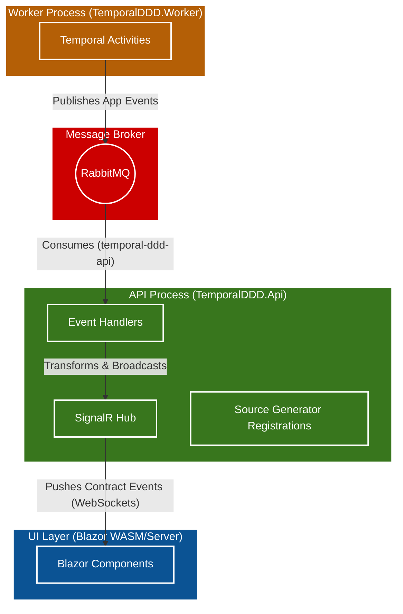

# Temporal + DDD + Clean Architecture Prototype

This project is a proof-of-concept demonstrating how to integrate Temporal into a strict Domain-Driven Design (DDD) and Clean Architecture (Hexagonal) .NET environment.

## Architectural Goals
1. **Domain Isolation:** The `Domain` project has **zero** external dependencies. It contains pure C# models, aggregates, and domain rules.
2. **Temporal as Application Orchestrator:** The `Application` project contains Temporal Workflows acting as "Process Managers" (Sagas). It defines the interfaces (Ports) for Activities but does not implement them.
3. **Infrastructure as Adapters:** The `Infrastructure` project implements the Temporal Activities, database repositories, and external API clients.
4. **Feature Slices:** Within each layer, code is grouped by feature (e.g., `ProviderOnboarding`) rather than technical concern (e.g., `Models`, `Services`) to maximize cohesion.

## Project Structure

- **TemporalDDD.Domain**
  - Pure domain models, aggregates, and business rules (no external dependencies)
  - [DomainDrivenDesign.md](src/TemporalDDD.Domain/DomainDrivenDesign.md)

- **TemporalDDD.Application**
  - Temporal workflows and activity interfaces (orchestration layer)
  - [TemporalWorkflow.md](src/TemporalDDD.Application/TemporalWorkflow.md)

- **TemporalDDD.Infrastructure**
  - Activity implementations, repositories, external API clients
  - [TemporalActivity.md](src/TemporalDDD.Infrastructure/TemporalActivity.md)
  - [CQRS.md](src/TemporalDDD.Infrastructure/CQRS.md)

- **TemporalDDD.Worker**
  - Temporal worker host

- **TemporalDDD.Api**
  - HTTP API for starting workflows (port 5000/5001)
  - [Controller.md](src/TemporalDDD.Api/Controller.md)

- **TemporalDDD.UI**
  - Blazor UI for workflow management (port 5000/5001)

## High-Level Topology



## Prerequisites
* .NET 10 SDK
* Docker Desktop

## Getting Started

### 1. Start Temporal with Docker

Navigate to the `src` directory and start the Temporal server:

```bash
cd src
docker-compose up -d
```

This will start:
- **Temporal Server** on ports `7233` (gRPC) and `8233` (Web UI)
- Access the Temporal Web UI at http://localhost:8233

### 2. Run the Applications

Open three terminal windows and run:

**Terminal 1 - API:**
```bash
cd src/TemporalDDD.Api
dotnet run
```

**Terminal 2 - Worker:**
```bash
cd src/TemporalDDD.Worker
dotnet run
```

**Terminal 3 - UI:**
```bash
cd src/TemporalDDD.UI
dotnet run
```

The UI will be available at https://localhost:5001 (accept the self-signed certificate warning).

### 3. Apply Database Migrations

The application uses SQLite for data storage and messaging. Migrations are automatically applied on startup via the `DatabaseInitializationService`.

## Architecture Notes

### Messaging
This project uses Rebus with SQLite for message passing between the Worker and API processes. The message queue shares the same SQLite database as the application data, eliminating the need for an external message broker.

### Database
All data (application data and message queue) is stored in a single SQLite file located at:
```
%LocalAppData%\TemporalDDD\temporal_playground.sqlite
```

